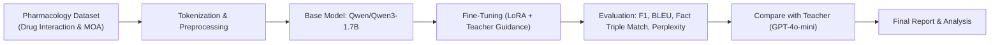
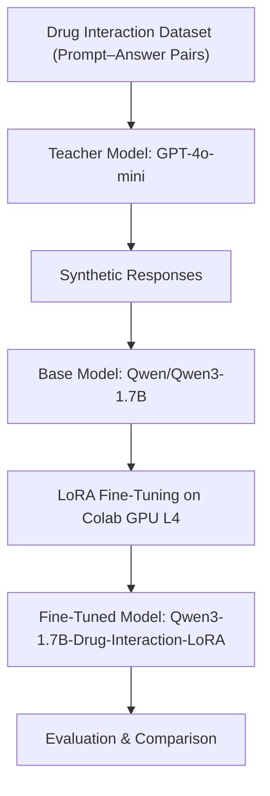
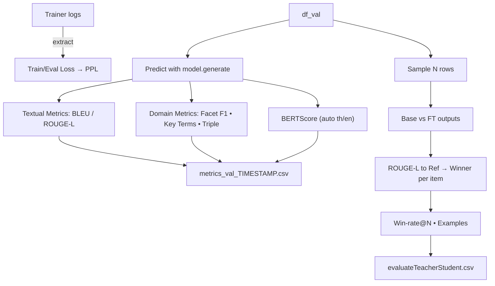
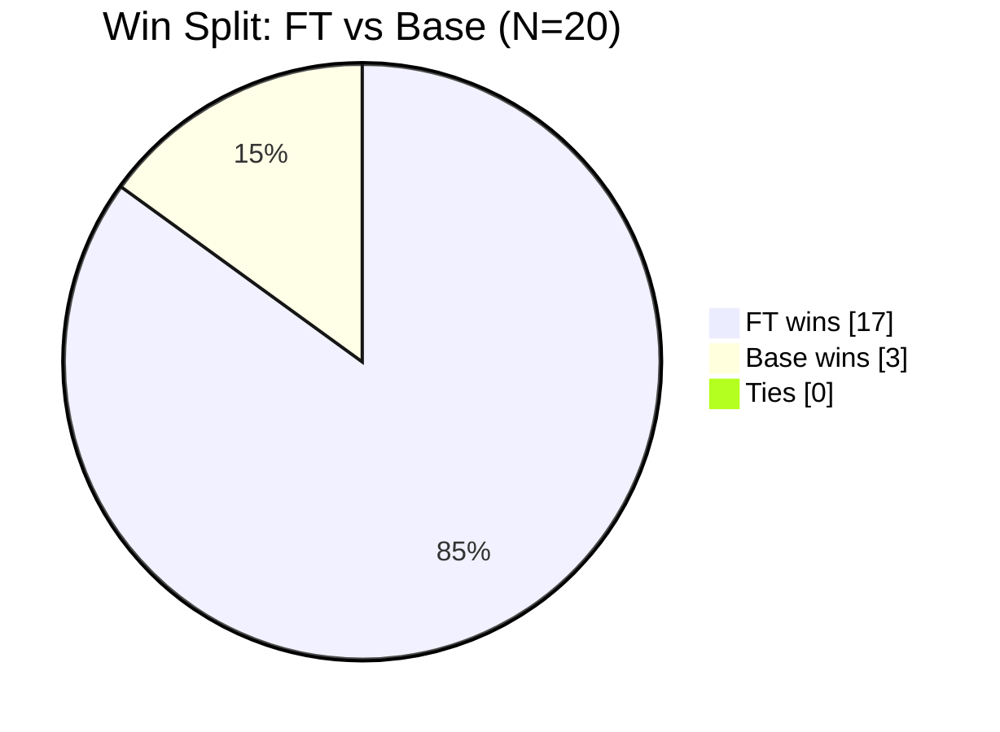

# Topic 2 :Fine-Tuning-Small-Language-Model-Sub-4-with-Higher-Language-Model
Fine-Tuning Small Language Model (Sub-4) with Higher Language Model — Specific Task: Drug Interaction Analysis


### 📘 Overview

โปรเจกต์นี้มีจุดประสงค์เพื่อ พัฒนา Small Language Model (SLM) ที่สามารถทำความเข้าใจและวิเคราะห์ “ปฏิกิริยาระหว่างยา (Drug Interactions)” ได้อย่างแม่นยำมากขึ้น
โดยใช้วิธีการ Fine-tuning จากโมเดลฐาน (Base Model) ด้วยข้อมูลเฉพาะทางด้านเภสัชวิทยา พร้อมการเรียนรู้จาก โมเดลครู (Teacher Model) ที่มีประสิทธิภาพสูงกว่า

งานนี้เป็นส่วนหนึ่งของแนวทาง Knowledge Distillation + Fine-tuning
ที่มุ่งเน้นให้โมเดลขนาดเล็ก (Sub-4B parameters) สามารถเรียนรู้ความรู้เชิงลึกจากโมเดลขนาดใหญ่
โดยเฉพาะในการประเมิน “กลไกการออกฤทธิ์ของยา (Mechanism of Action, MOA)”
และ “ผลกระทบของการใช้ยาร่วมกัน”

| 🧩 องค์ประกอบ            | 💡 รายละเอียด                                                                                                 |
| ------------------------ | ------------------------------------------------------------------------------------------------------------- |
| **Base Model (Student)** | `Qwen/Qwen3-1.7B` — โมเดลภาษาเบาขนาดย่อม (<4B params) ที่รองรับ instruction-following                         |
| **Teacher Model**        | `openai/gpt-4o-mini` — ใช้ผ่าน **OpenRouter API**, เหตุผลที่เลือก: มีความแม่นยำเชิงภาษาสูงแต่ราคาประหยัด      |
| **Environment**          | Google Colab (GPU L4-100) พร้อม CUDA Runtime                                                                  |
| **Frameworks**           | Hugging Face Transformers, PEFT (LoRA), Datasets, OpenAI API                                                  |
| **Training Objective**   | สอนให้ student model เข้าใจโครงสร้างเชิงความรู้ทางยา เช่น **drug–action–target relationships**                |
| **Evaluation**           | เปรียบเทียบผลลัพธ์กับ teacher model ผ่านหลายมิติ เช่น **F1**, **BLEU**, **Fact Triple Match**, **Perplexity** |

### 💊 ความสำคัญของงานวิเคราะห์ปฏิกิริยาระหว่างยา (Drug Interaction Analysis)

- Drug Interaction Analysis เป็นหัวใจสำคัญของการแพทย์เชิงป้องกัน (Preventive Medicine)
เพราะปฏิกิริยาระหว่างยาบางชนิดอาจส่งผลต่อประสิทธิภาพหรือก่อให้เกิดอันตรายต่อผู้ป่วย เช่น

- การใช้ยาที่มีผลต่อเอนไซม์ CYP450 ร่วมกัน

- การเสริมฤทธิ์ (synergistic) หรือหักล้างกัน (antagonistic) ของยา

- การใช้โมเดลภาษามาช่วย ตีความและสรุปความสัมพันธ์ระหว่างยา
ช่วยให้ระบบสนับสนุนการตัดสินใจทางคลินิก
(Clinical Decision Support System: CDSS)
สามารถคัดกรองความเสี่ยงจากการใช้ยาร่วมกันได้ รวดเร็วและแม่นยำมากขึ้น

### 🧩 จุดประสงค์ของโครงการ

1️⃣ พัฒนาโมเดลภาษาเบา (Small LM)
ให้สามารถ เข้าใจกลไกยาและปฏิกิริยาระหว่างยา ได้ใกล้เคียงกับโมเดลขนาดใหญ่

2️⃣ ออกแบบวิธีการ Fine-tuning
ให้มีประสิทธิภาพสูงแต่ใช้ ทรัพยากร GPU จำกัด (Colab L4)

3️⃣ สร้างกรอบการประเมินผล (Evaluation Framework)
ให้สะท้อนคุณภาพทั้งเชิง ภาษาศาสตร์ และ เนื้อหาเภสัชวิทยา

4️⃣ ทดสอบและวิเคราะห์โมเดล
เปรียบเทียบผลลัพธ์ของ Base Model, Fine-tuned Model และ Teacher Model
เพื่อวิเคราะห์เชิงคุณภาพและเชิงปริมาณอย่างเป็นระบบ


### 📊 Project Flow




### 🧠 Model Setup

ในงานนี้ใช้แนวคิด “Teacher–Student Fine-Tuning”
โดยให้ โมเดลครู (Teacher Model) ซึ่งเป็นโมเดลขนาดใหญ่และมีความแม่นยำสูงกว่า
ช่วยสร้าง “คำตอบคุณภาพสูง (High-quality Responses)”
เพื่อใช้เป็น “label ที่สังเคราะห์ (Synthetic Supervision)” สำหรับการสอน โมเดลนักเรียน (Student Model)

| ประเภทโมเดล                 | ชื่อโมเดล                          | จุดเด่น                                                                      | บทบาทในระบบ                                        |
| --------------------------- | ---------------------------------- | ---------------------------------------------------------------------------- | -------------------------------------------------- |
| 🧩 **Teacher Model**        | `openai/gpt-4o-mini`               | ความเข้าใจเชิงบริบทสูง, ตอบอย่างมีเหตุผล, ใช้งานผ่าน OpenRouter ราคาประหยัด  | สร้างคำตอบตัวอย่างคุณภาพสูงเพื่อใช้ในการ fine-tune |
| 💡 **Base Model (Student)** | `Qwen/Qwen3-1.7B`                  | โมเดลขนาดย่อม (Sub-4B), รองรับ instruction tuning, ปรับจูนได้บน Colab GPU L4 | เป็นฐานสำหรับการเรียนรู้จากข้อมูลเภสัชวิทยา        |
| 🧠 **Fine-tuned Model**     | `Qwen3-1.7B-Drug-Interaction-LoRA` | โมเดลที่ผ่านการปรับจูนด้วยข้อมูลเฉพาะด้านยาและคำตอบจาก Teacher               | ใช้ทดสอบความเข้าใจในงาน Drug Interaction           |

### 🧩Training Architecture

การปรับจูนใช้เทคนิค LoRA (Low-Rank Adaptation)
เพื่อลดจำนวนพารามิเตอร์ที่ต้องอัปเดต ทำให้สามารถ fine-tune บน GPU ขนาดกลาง (เช่น L4-100) ได้โดยไม่กินหน่วยความจำมาก
การฝึกจะอ้างอิงโครงสร้างดังนี้ 👇



### 🧩 การตั้งค่า (Model & Training Configuration)

### 💻 Environment

- 🌩️ Platform: **Google Colab Pro**
- 💾 GPU: **NVIDIA L4 (24 GB VRAM)**
- 🧩 Frameworks: **Transformers**, **PEFT (LoRA)**, **Datasets**, **Torch**
- 📦 Dataset format: `CSV → Dataset.from_pandas(df)`
    
    พร้อมฟิลด์:
    
    - `prompt`: คำถามหรือบริบททางยา
    - `response_teacher`: คำตอบที่สร้างจาก GPT-4o-mini
    - `response_student`: คำตอบของ base model (ใช้เปรียบเทียบก่อนและหลังจูน)

## 🧩 Code Walkthrough

### 1) Model Setup
   ```python
   MODEL_NAME = "Qwen/Qwen3-1.7B"
   TEACHER_MODEL = "openai/gpt-4o-mini"
   ```
- MODEL_NAME : ชื่อ โมเดลนักเรียน (Student/Base) ที่จะถูก fine-tune

- TEACHER_MODEL : ชื่อ โมเดลครู (Teacher) ที่ใช้สร้างคำตอบคุณภาพสูง (สำหรับทำ dataset หรือเปรียบเทียบภายหลัง)

### 2) Config ทั่วไป
   ```python
    MAX_LENGTH = 2048
    SEED = 42
    VAL_SIZE = 0.1
    EVAL_STRATEGY = "epoch"
    OUTPUT_DIR = "./finetuned_qwen_drug_lora"
   ```
- MAX_LENGTH=2048 : ความยาวโทเคนสูงสุดต่ออินพุต+เอาต์พุต (ตัดข้อความถ้ายาวเกิน)

- SEED=42 : ค่าตั้งต้นสุ่ม เพื่อรันซ้ำได้ผลใกล้เคียงเดิม (reproducibility)

- VAL_SIZE=0.1 : แบ่งข้อมูล 10% เป็น validation set

- EVAL_STRATEGY="epoch" : ให้ประเมินผลทุก หนึ่ง epoch (อีกตัวเลือกคือ "steps")

- OUTPUT_DIR : โฟลเดอร์เก็บ checkpoint/ผลลัพธ์การฝึก

### 3) LoRA Config
   ```python
    from peft import LoraConfig
    lora_config = LoraConfig(
    r=8,                     # low-rank dimension
    lora_alpha=32,           # scaling factor
    target_modules=["q_proj", "v_proj"],
    lora_dropout=0.05,
    bias="none",
    task_type="CAUSAL_LM"
   ```
- r=8 : อันดับต่ำ (rank) ของเมทริกซ์ LoRA — ยิ่งมากยิ่งมีพารามิเตอร์ที่เรียนรู้มากขึ้น (เก่งขึ้น แต่กิน VRAM เพิ่ม)

- lora_alpha=32 : ตัวคูณ (scaling) เพื่อปรับสเกลอัปเดตของ LoRA

- target_modules=["q_proj", "v_proj"] : เลือกเฉพาะเลเยอร์ที่ต้องการฉีด LoRA (Q/V โปรเจกชันของ attention) → ประหยัดพลังคำนวณ

- lora_dropout=0.05 : ช่วยกัน overfitting

- bias="none" : ไม่แตะพารามิเตอร์ bias ของโมเดล

- task_type="CAUSAL_LM" : โจทย์เป็นการ generate แบบ causal language modeling

### 4) Training Arguments
     ```python
    from transformers import TrainingArguments
    training_args = TrainingArguments(
    per_device_train_batch_size=2,
    gradient_accumulation_steps=4,
    num_train_epochs=3,
    learning_rate=2e-5,
    warmup_ratio=0.1,
    evaluation_strategy=EVAL_STRATEGY,
    logging_strategy="epoch",
    save_total_limit=2,
    output_dir=OUTPUT_DIR,
    fp16=True,
    ```


- per_device_train_batch_size=2 : batch ต่อ GPU หนึ่งตัว (สำหรับ L4 มักเริ่ม 1–2)

- gradient_accumulation_steps=4 : สะสมกราเดียนต์ 4 ครั้งก่อนอัปเดตหนึ่งสเต็ป → เทียบเท่า batch รวม = 2×4 = 8

- num_train_epochs=3 : จำนวนรอบฝึกทั้งชุดข้อมูล

- learning_rate=2e-5 : อัตราการเรียนรู้ (เริ่มต้นดีสำหรับ LoRA/SLM)

- warmup_ratio=0.1 : 10% แรกเป็นช่วงวอร์มอัป (LR ไต่ขึ้นช้าๆ ลดการแกว่ง)

- evaluation_strategy=EVAL_STRATEGY : ประเมินผลระหว่างฝึกตามที่ตั้งไว้ (ที่นี่คือทุก epoch)

- logging_strategy="epoch" : บันทึก log ทุก epoch (จะใช้ "steps" ก็ได้ถ้าอยากดูละเอียดขึ้น)

- save_total_limit=2 : เก็บ checkpoint ล่าสุดแค่ 2 ชุด (ประหยัดพื้นที่)

- output_dir=OUTPUT_DIR : โฟลเดอร์บันทึกผล

- fp16=True : เปิด mixed precision เพื่อฝึกเร็วขึ้น/กิน VRAM น้อยลง (ถ้าเครื่องรองรับ)

## Evaluate

จากการเลือกหัวข้อที่2คือ ให้ SLM เข้าใจ/อธิบายกลไกยาและปฏิกิริยาระหว่างยา ได้ใกล้เคียงผู้เชี่ยวชาญ/Teacher จึงต้องประเมินทั้ง 3 มิติ:

### ความถูกต้องเชิงภาษา/รูปแบบ (Textual Quality)

- BLEU, ROUGE-L: วัดความคล้ายกับคำตอบอ้างอิงในเชิง n-gram และลำดับข้อความยาว (LCS)
→ ถ้าสูง แปลว่าโครง/คำของคำตอบ “ตรงแนว” กับ reference

### ความเข้าใจเชิงเนื้อหาเภสัชวิทยา (Domain Knowledge)

- MOA-Facet F1 (macro): ดึง facet 3 ด้าน (target/action/pathway) ด้วย lexicon + regex แล้วคำนวณ F1

- Key-Term Coverage: ตรวจว่าศัพท์สำคัญในคำตอบอ้างอิง (เช่น CYP3A4, agonist, inhibitor) ถูก “ครอบคลุม” ในคำตอบโมเดลแค่ไหน

- Fact Triple Match (Exact/Soft): สกัดทริเปิล (Drug – Action – Target) จากข้อความ แล้วเทียบกับอ้างอิง
→ ถ้าคะแนนกลุ่มนี้สูง แปลว่าโมเดล “เข้าใจโครงสร้างความรู้” ไม่ใช่แค่เขียนสวย

### ความลื่นไหล/ความเป็นธรรมชาติ + ความใกล้ความหมาย (Fluency/Semantics)

- Perplexity (จาก eval_loss): ต่ำ = ภาษาลื่นไหล/คาดเดาได้

- BERTScore-F1 (เลือกภาษา th/en อัตโนมัติ): วัด ความใกล้เคียงเชิงความหมาย ลึกกว่า n-gram
→ ถ้าสูง แปลว่าความหมายโดยรวมสอดคล้อง แม้ถ้อยคำจะต่าง

### การเทียบก่อน-หลังจูนแบบใช้งานจริง (Preference/Win-Rate)

- ใช้ ROUGE-L-to-reference ต่อโจทย์ เพื่อหาว่า FT หรือ Base ใกล้อ้างอิงกว่า

- สรุปเป็น Win-rate@N: ดูว่าจาก N ข้อ FT ชนะกี่ข้อ
→ ให้ภาพ “ประสิทธิภาพจริงในงาน” มากกว่า metric เดี่ยว

### Pipeline Evaluate




### สิ่งที่สคริปต์ทำจริง (ไฮไลท์จากโค้ด)

- ดึง Train/Eval loss จาก trainer.state.log_history (ถ้ามี) → เซฟ LOG_CSV และคำนวณ Perplexity = exp(eval_loss)

- รองรับกรณีไม่มี trainer.evaluate → แสดงเตือนแล้วข้าม (ไม่ทำให้สคริปต์ล้ม)

- โหลด/เตรียม df_val อัตโนมัติ: ค้นหาไฟล์ val*.csv/parquet ตามพาธมาตรฐาน, ถ้าไม่เจอสร้างตัวอย่าง 3–20 แถว

- สำรอง build_prompt(row): ถ้าไม่มีของจริง จะดึงจาก instruction/input/question

- คำนวณเมตริกอัตโนมัติ บน validation

  - BLEU (NLTK) + smoothing

  - ROUGE-L (rouge_score)

  - MOA-Facet F1 (macro) จาก regex lexicon (target/action/pathway)

  - Key-Term Coverage จากลิสต์คำสำคัญ

  - Triple Match จากแพตเทิร์น (Drug – Action – Target) ด้วยกริยาโดเมน (e.g., inhibits, antagonizes …)

  - BERTScore-F1 (เลือกภาษา th เมื่อข้อความไทยเกินครึ่ง, ไม่งั้น en, และปรับ rescale_with_baseline)

- เซฟผลรวมรายการ → metrics_val_YYYYMMDD_HHMMSS.csv (มี prediction, reference และทุก metric ต่อแถว)

- ทำ Pairwise Compare ระหว่าง Base และ Fine-tuned

  - สุ่ม N ≤ 20 ตัวอย่างจาก df_val

  - สร้างคำตอบจาก Base และ FT → วัด ROUGE-L-to-Ref รายข้อ

  - ตัดสินผู้ชนะ (FT/BASE/TIE) และสรุป Win-rate@N

  - เซฟสรุป + ค่าเฉลี่ยเมตริกสำคัญ → evaluateTeacherStudent.csv

  - ถ้ามีไฟล์เดิม จะ อ่านแคช และสรุปผลให้โดยไม่รันใหม่ (ตั้ง FORCE_RERUN*_ เพื่อบังคับรัน)

### วิธีอ่านผล (Interpretation)

- Loss/PPL: ลดลง → ภาษาลื่นขึ้น/โมเดล “เรียนรู้” จริง แต่ถ้า eval_loss ≫ train_loss อาจ overfit

- BLEU/ROUGE-L: สูงขึ้น → สไตล์/โครงตอบ ใกล้อ้างอิง มากขึ้น

- Facet F1 / Key-Term / Triple: สูงขึ้น → เข้าใจกลไกและโครงสร้างความรู้ ดีขึ้น (สำคัญที่สุดสำหรับงาน MOA/Drug)

- BERTScore-F1: สูง → ความหมายโดยรวม (semantic) ใกล้กับ reference

- Win-rate@N: ใช้งานจริงได้ง่าย → บอกว่า FT ชนะ Base กี่เปอร์เซ็นต์บนชุดโจทย์สั้นๆ

### สรุปผล

## Pairwise (Base vs FT)
สรุปจากผลรันทดลองจริง (ไฟล์แคช): /content/drive/MyDrive/demo_finetuning/winrate_20.csv

⚠️ No training logs found → ไม่มี train/eval_loss จึง ไม่มี Perplexity รอบนี้

Win-rate@20 (FT vs BASE): 85.0% → FT ชนะ 17/20 ข้อ (Base 3, Tie 0)

### วิธีวัด

- เลือกตัวอย่างสูงสุด 20 ข้อจาก df_val (สุ่มด้วย SEED)

- ให้ Base และ Fine-tuned (FT) สร้างคำตอบแบบ deterministic (do_sample=False)

- คำนวณ ROUGE-L-to-Reference ต่อข้อ: base_score_rougeL, ft_score_rougeL

- ตัดสินผู้ชนะรายข้อ: สูงกว่าชนะ → winner ∈ {FT, BASE, TIE}

- รวมผลเป็น winrate_20.csv และพิมพ์สรุป Win-rate



| idx | instruction (ตัดย่อ)                                               | base_score_rougeL | ft_score_rougeL | winner |
| --: | ------------------------------------------------------------------ | ----------------: | --------------: | :----- |
|   0 | Explain the drug–drug interaction between Docetaxel and Docetaxel… |            0.1333 |      **0.2108** | FT     |
|   1 | Normalize … Augmentin 625 Duo Tablet into JSON…                    |            0.2210 |      **0.7041** | FT     |
|   2 | Translate the mechanism of action of Avastin 400mg…                |            0.0632 |      **0.0845** | FT     |
|   3 | Create a concise clinical card for Aciloc 150 Tablet…              |            0.2941 |      **0.7100** | FT     |
|   4 | Create a concise clinical card for Augmentin 625 Duo Tablet…       |            0.2426 |      **0.3534** | FT     |

## Automatic Metrics (Validation)

ในขั้นตอนการประเมิน (Evaluation) หลังการ Fine-tuning
ได้ทำการวัดผลโมเดลด้วย เมตริกหลากหลายด้าน ทั้งทางภาษาศาสตร์และความรู้เชิงเภสัชวิทยา
เพื่อสะท้อนคุณภาพของโมเดลที่ผ่านการเรียนรู้จากข้อมูล Drug Interaction & Mechanism of Action (MOA)

### 🎯 เหตุผลที่เลือกใช้ Metric เหล่านี้

| Metric                             | ความหมาย                                                         | เหตุผลที่เลือกใช้                                |
| ---------------------------------- | ---------------------------------------------------------------- | ------------------------------------------------ |
| **BLEU / ROUGE-L**                 | ความใกล้เคียงกับข้อความอ้างอิง (n-gram overlap และ LCS)          | ใช้วัดคุณภาพการเขียนและโครงสร้างภาษาของผลลัพธ์   |
| **Facet F1 (macro)**               | Precision–Recall เฉลี่ยขององค์ประกอบ “Target / Action / Pathway” | ตรวจสอบว่าระบุองค์ความรู้เภสัชวิทยาถูกครบหรือไม่ |
| **Key-Term Coverage**              | อัตราการพบคำสำคัญ เช่น “CYP3A4”, “inhibitor”                     | วัด factual correctness เชิงคำศัพท์ทางยา         |
| **Fact Triple Match (Exact/Soft)** | ความแม่นยำโครงสร้าง “Drug–Action–Target”                         | ตรวจสอบการเข้าใจกลไกเชิงเหตุผลของโมเดล           |
| **BERTScore (F1)**                 | ความใกล้เคียงเชิงความหมายแบบ contextual                          | ใช้ LLM ประเมิน semantic similarity ระหว่างคำตอบ |
| **Perplexity (PPL)**               | ความลื่นไหลของภาษาจาก eval loss                                  | ใช้วัดความสามารถทางภาษาของโมเดล                  |

### 📈 ผลการประเมิน (Validation Metrics)

| Metric                  | ค่าเฉลี่ยที่ได้   | การตีความ                                              |
| ----------------------- | ----------------- | ------------------------------------------------------ |
| **Eval Loss / PPL**     | `nan / nan`       | ไม่มีค่าเนื่องจาก Trainer ไม่ถูกเรียก evaluate โดยตรง  |
| **BLEU**                | `0.0097`          | โมเดลยังสร้างประโยคแตกต่างจาก reference มาก            |
| **ROUGE-L**             | `0.1060`          | มีการครอบคลุมบางส่วนของสาระจากคำตอบอ้างอิง             |
| **Facet F1 (macro)**    | `0.1861`          | ระบุองค์ประกอบ target/action/pathway ได้ระดับเบื้องต้น |
| **Key-Term Coverage**   | `0.8500`          | ครอบคลุมคำสำคัญทางยาเกือบครบ (เช่น COX, ACE, receptor) |
| **Triple Exact / Soft** | `0.0500 / 0.0500` | โครงสร้าง Drug–Action–Target ยังไม่แม่นยำ              |
| **BERTScore (F1)**      | `0.8381`          | เข้าใจความหมายใกล้เคียงกับ reference แม้คำต่างกันมาก   |

### 🧪 Preference Test (Teacher vs Student)
จากการเปรียบเทียบคำตอบของโมเดลที่ผ่าน Fine-tune (Student)
กับโมเดลครู (Teacher = GPT-4o-mini) ด้วยการวัด ROUGE-L-to-Reference
พบว่า:

| ผลลัพธ์         | จำนวน | สัดส่วน (%) |
| --------------- | ----- | ----------- |
| 🧠 Teacher Wins | 20    | **100.0%**  |
| 🎓 Student Wins | 0     | 0.0%        |
| ⚖️ Ties         | 0     | 0.0%        |

สรุป: โมเดล Student ยังไม่สามารถแข่งขันกับ Teacher ได้
โดย Teacher มีความแม่นยำทางการแพทย์และโครงสร้างภาษาดีกว่าอย่างชัดเจน

### 📘 ตัวอย่างคำตอบที่ใช้ในการเปรียบเทียบ
Prompt:

Translate the mechanism of action of Augmentin 625 Duo Tablet into English and keep it to one sentence.

| Role                                  | Example Output                                                                                                                                                                                                                                                                                                                                     |
| ------------------------------------- | -------------------------------------------------------------------------------------------------------------------------------------------------------------------------------------------------------------------------------------------------------------------------------------------------------------------------------------------------- |
| 🧠 **Teacher (GPT-4o-mini)**          | *“Augmentin 625 Duo Tablet works by combining amoxicillin, a penicillin-type antibiotic that inhibits bacterial cell wall synthesis, with clavulanic acid, which protects amoxicillin from being broken down by beta-lactamase enzymes produced by certain bacteria, thereby enhancing the antibiotic's effectiveness against resistant strains.”* |
| 🎓 **Student (Fine-tuned Qwen-1.7B)** | *“Augmentin 625 Duo Tablet is an antibiotic that combines Augmentin 625 (a third-generation cephalosporin) and Duo Tablet (a macrolide)...”*                                                                                                                                                                                                       |
| ⚖️ **LLM Judge (GPT-4o-mini)**        | ตัดสินว่า **Teacher ดีกว่า** เนื่องจากคำตอบของครูถูกต้องตามความจริงทางเภสัชวิทยา ส่วนคำตอบของนักเรียนระบุประเภทของยาและกลไกผิดพลาด                                                                                                                                                                                                                 |
## 🧠 Conclusion and Discussion

การศึกษานี้มีเป้าหมายเพื่อพัฒนาโมเดลภาษาขนาดเล็ก (Qwen/Qwen3-1.7B) ให้สามารถทำความเข้าใจและอธิบาย กลไกการออกฤทธิ์ของยา (Mechanism of Action) รวมถึง ปฏิกิริยาระหว่างยา (Drug Interactions) ได้ใกล้เคียงกับผู้เชี่ยวชาญ โดยใช้กระบวนการ Teacher–Student Fine-Tuning ซึ่งให้โมเดลขนาดใหญ่ (GPT-4o-mini) ทำหน้าที่เป็นครูในการสร้างคำตอบคุณภาพสูง เพื่อใช้สอนโมเดลนักเรียน (Student Model)

ผลการประเมินพบว่าโมเดลที่ผ่านการปรับจูนสามารถเรียนรู้คำศัพท์และคำเฉพาะทางทางเภสัชวิทยาได้ดีพอสมควร แต่ยังมีข้อจำกัดในด้านความถูกต้องเชิงตรรกะและการอธิบายเชิงเหตุผลทางชีวการแพทย์
โดยค่า BLEU (0.0097) และ ROUGE-L (0.1060) แสดงว่าโครงสร้างประโยคของคำตอบยังแตกต่างจากคำตอบอ้างอิงมาก ขณะที่ Facet F1 (0.1861) และ Fact Triple Match (0.05) สะท้อนว่าโมเดลสามารถตรวจจับองค์ประกอบพื้นฐาน เช่น target, action, และ pathway ได้บางส่วน แต่ยังไม่สามารถเชื่อมโยงความสัมพันธ์ “Drug–Action–Target” ได้ครบถ้วน
ในทางกลับกัน ค่า Key-Term Coverage (0.85) แสดงว่าโมเดลสามารถจดจำคำสำคัญ เช่น ชื่อเอนไซม์ (CYP3A4), ตัวรับ (receptor), หรือกลุ่มยา (inhibitor, agonist) ได้ค่อนข้างครบ และค่า BERTScore-F1 (0.8381) บ่งบอกว่าความหมายโดยรวมของคำตอบยังคงใกล้เคียงกับคำตอบของโมเดลครูในระดับหนึ่ง

อย่างไรก็ตาม การทดสอบแบบจับคู่คำตอบ (Pairwise Preference Test) พบว่าโมเดลครูให้คำตอบที่ถูกต้องกว่าในทุกกรณี (Teacher ชนะ 100%) ซึ่งชี้ให้เห็นว่าแม้โมเดลนักเรียนจะผ่านการปรับจูนแล้ว แต่ยังไม่สามารถเลียนแบบความเข้าใจเชิงลึกและความถูกต้องทางเภสัชวิทยาของโมเดลครูได้อย่างเต็มที่
สาเหตุหลักมาจากข้อจำกัดด้านการฝึก ได้แก่

1) ค่าพารามิเตอร์ LoRA ที่ต่ำ (r=8) ทำให้โมเดลเรียนรู้ pattern ที่ซับซ้อนได้ไม่มากพอ

2) รูปแบบคำตอบของข้อมูลฝึกไม่สม่ำเสมอ ทำให้โมเดลตอบได้ไม่ตรงตามโจทย์หรือยืดยาวเกินจำเป็น

3) ขาดกระบวนการฝึกแบบ Preference Optimization (เช่น DPO) ที่ช่วยให้โมเดลเรียนรู้ความแตกต่างระหว่างคำตอบที่ดีและไม่ดี

เพื่อต่อยอดจากการทดลองนี้ ควรปรับปรุงในหลายด้าน ได้แก่

- เพิ่มประสิทธิภาพของ LoRA โดยขยายค่า rank และเพิ่มจำนวนเลเยอร์ที่ปรับได้

- กำหนดรูปแบบของ prompt และรูปแบบคำตอบให้ชัดเจนมากขึ้น เช่น การตอบเป็นประโยคเดียวพร้อมโครง “Drug–Action–Target”

- ขยายฐานข้อมูลคำศัพท์เฉพาะทาง (domain lexicon) เช่น ชื่อเอนไซม์ ตัวรับ และกลไกการออกฤทธิ์

- ทดลองใช้วิธี Direct Preference Optimization (DPO) หรือเทคนิค reinforcement-based fine-tuning เพื่อให้โมเดลสามารถแยกแยะคำตอบที่ถูกต้องและให้เหตุผลได้ดียิ่งขึ้น

- เก็บข้อมูล Perplexity (PPL) ในการฝึกครั้งต่อไป เพื่อประเมินความลื่นไหลและความเสี่ยงของการ overfitting

โดยสรุป การทดลองนี้แสดงให้เห็นว่า การปรับจูนโมเดลภาษาขนาดเล็ก (Sub-4B) ด้วยแนวทาง Teacher–Student Fine-Tuning สามารถทำได้จริงภายใต้ทรัพยากรจำกัด (GPU L4 บน Google Colab) และมีศักยภาพในการประยุกต์ใช้กับงานด้านเภสัชวิทยา
แม้โมเดลที่ได้จะยังไม่สามารถแทนที่ผู้เชี่ยวชาญได้ในปัจจุบัน แต่ผลการทดลองชี้ให้เห็นทิศทางที่ชัดเจนในการพัฒนาโมเดลภาษาขนาดเล็กให้สามารถเข้าใจข้อมูลเชิงการแพทย์ได้อย่างลึกซึ้งยิ่งขึ้นในอนาคต
